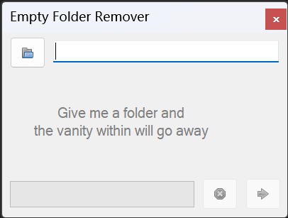

# Project Description

This application removes all sub-folders (and the folder itself) where vanity is found. In other words: Recursivly checks for and deletes empty folders. Simple as that.

This project is a fork of [Svish/vanity-remover](https://github.com/Svish/vanity-remover).

Licensed under MIT license.

## How to use:

* Download and run.
* Select a folder, by either:
  * Typing it in to the textbox.
  * Choosing it with the folder dialog (click the button next to the textbox).
  * Drag and drop a folder from explorer unto the application.
* Press enter or click the green arrow.

## Warning:

* Do **NOT** use the software in TrustedInstaller or SYSTEM users, which may cause problems including but not limited to the following:
	* Your Microsoft account may logoff unexpectedly.
      * To fix it, you need to sign in with a local account in Settings app, and then sign in with Microsoft account again.
  * Some UWP apps may not function normally.
      * To fix it, you need to reset the app in Setting app. If that doesn't work, try to reinstall the app.